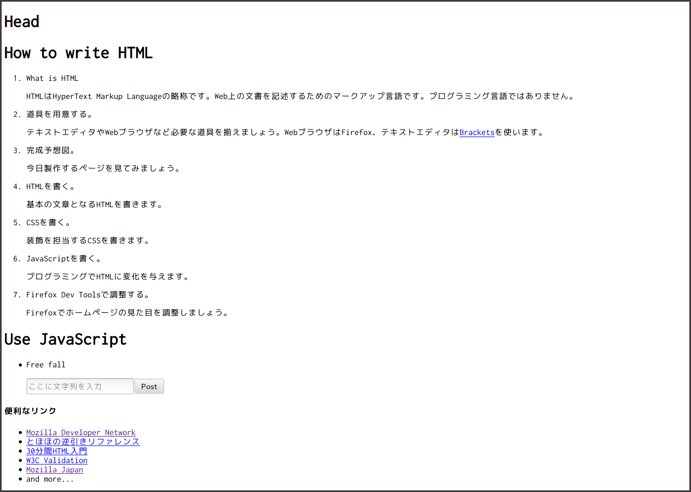
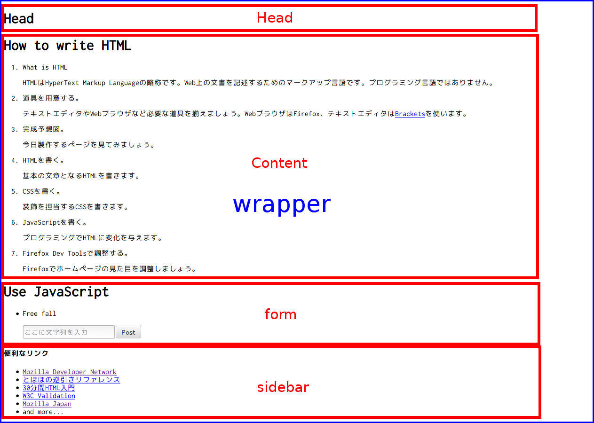

# ウェブページを書いてみよう！

## はじめに

 今回の勉強会は、自分の力でウェブページを書く為の基本的な知識を、実際にhtmlとCSS、JavaScriptを使ってウェブページを書いてもらいながら勉強する事を目的にしています。
 少し簡単過ぎるなぁ、と思う人はどんどん先に進んでもらって構いませんし、自分のペースに合わせて進めて下さい。

## 書く前の準備

 まず、ウェブページを書き始める前にテキストエディタを用意して下さい。テキストエディタとはWindowsのメモ帳のようなテキストを入力、編集するためのソフトウェアのことです。
テキストエディタには、Brackets, Vim, Emacs, Sublime Text 3, サクラエディタ等色々なものがありますので、自分にあったものを使ってください。特に候補がない場合は今回はPhotoshopやFlash Playerで有名なAdobe社が開発しているBracketsをおすすめします。

## htmlでウェブページの形を作ろう

 基本的なウェブページはhtml,css,javascriptの３つから構成され、それぞれ別々の役割があります。
 その中でもhtmlはウェブページの文章、レイアウトの基礎を担当し骨組みを作る役割を持ちます。
 まず初めにhtmlを書いて、ウェブページを形作って行きましょう。

 
 上のテストページはprotoフォルダ内にある、htmlファイル一つだけで出来ています。
 ウェブページで見えているものは、基本的に全て<hoge>~</hoge>の様なhtmlファイル上のタグを用いて表されています。
 htmlタグは、<hoge>~</hoge>の"hoge"の部分がタグ名となっており、タグ名によって実際にウェブページとしての表現が変わります。
 
 基本的なhtmlタグを以下にまとめましたので、覚えておいて下さい。

 - htmlタグ:htmlのバージョン情報や、エンコードの指定が可能なタグです。
 - bodyタグ:このタグの中の物がウェブページとして表示されます。
 - headタグ:ホームページのタイトルや、アイコン等の指定が出来ます。このタグ内で他のファイルを呼び出す事も出来ます。
 - divタグ:他のタグを中に収納する役割を持つタグ、例外なくほぼ全てのウェブページで使用されます。
 - olタグ:Ordered Listの略で、箇条書きを表す事が出来ます。liタグを使うことで箇条書きにする文章を書くことが出来ます。
 - aタグ:他のウェブページへのリンクを貼る事が出来ます。
 - imgタグ:画像を貼る事が出来ます。
 - h1~h6タグ:見出しを表します。
 - pタグ:段落を表します。

 div要素を用いる事でウェブページの骨組みを作る事が出来ますが、実際に先程のページも以下の様にdivタグで骨組みが作られています。
 
 このテストページでは、左側に表示したい部分をsidebarと言うidでdivタグを用いて表現し、ページのタイトル、本文、コメント欄をdivタグhead,content,formとして表現しています。sidebarは左側ではなく他のタグと同様に並んでしまっていますが、これは後のcssを用いる事で左側に配置する事が出来ます。

## CSSでウェブページの見た目を変えよう
 CSS, Cascading Style Sheetsはウェブページの色やレイアウトの見た目の部分を担当しています。  
 CSSは、見た目を変更したい要素を指定し、どのように変更するかについて記述することでhtmlに影響を与えます。  
 図示すると以下のようになります。

    変更したい要素{
      なにを変更するか:どのように変更するか;
    }

 変更したい要素を指定し、その要素をどのような見た目にするかを続く{}の中に指定します。  
 これだけでは分かりにくいので、実際にさきほど書いたhtmlの見た目をCSSで変更してみましょう。
 下記をstyle.cssに書き込み保存、ブラウザを更新してください。

    body{
      background-image: linear-gradient(darkblue,skyblue);
    }

 ウェブページの背景が変わったと思います。このようにCSSは背景などのウェブページの見た目を変更する役割を持っています。  
 上記のコードでは、    
 bodyという要素(変更したい要素)の   
 背景(なにを変更するか)を   
 ダークブルーとスカイブルーのグラデーション(どのように変更するか)に指定しています。
 
 変更したい要素をどのように指定すればいいのかを説明します。たとえば、<hoge>~</hoge>で囲まれた部分を修正したい時は**hoge**と書きます。
 また、さきほど出てきたidという指定も役に立ちます。id＝"sidebar"と指定した要素は**#sidebar**で指定することができます。
 style.cssを参考にウェブページに見た目を追加していってみましょう。
